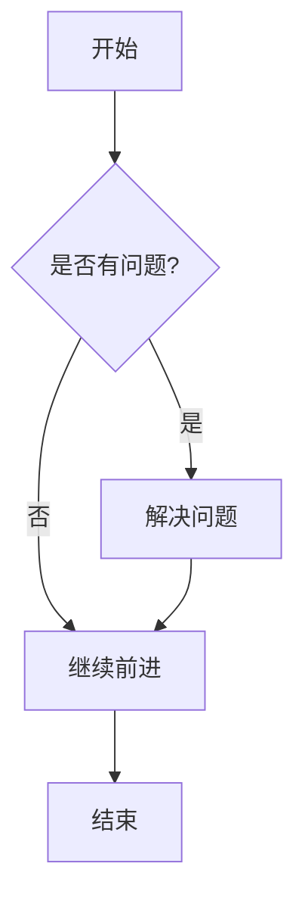
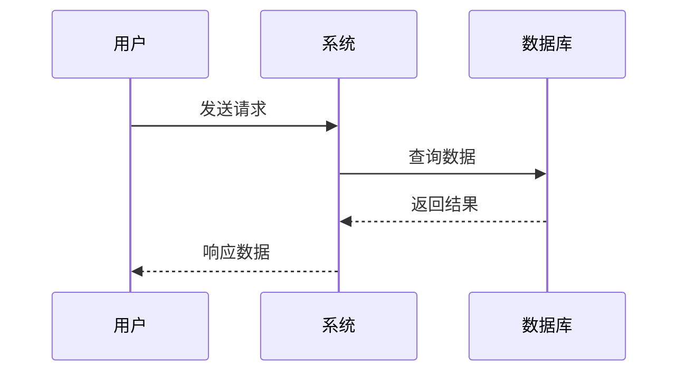
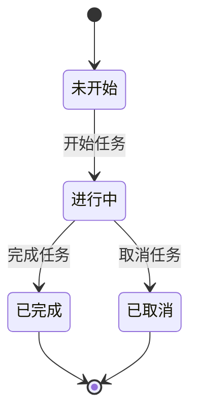
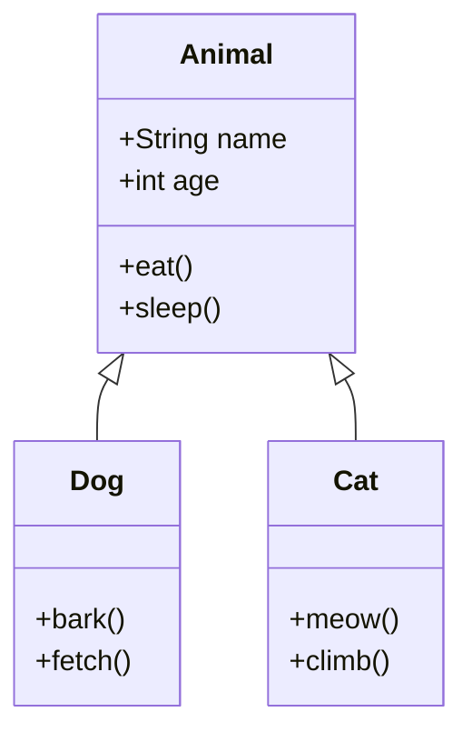
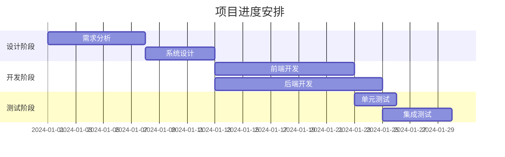
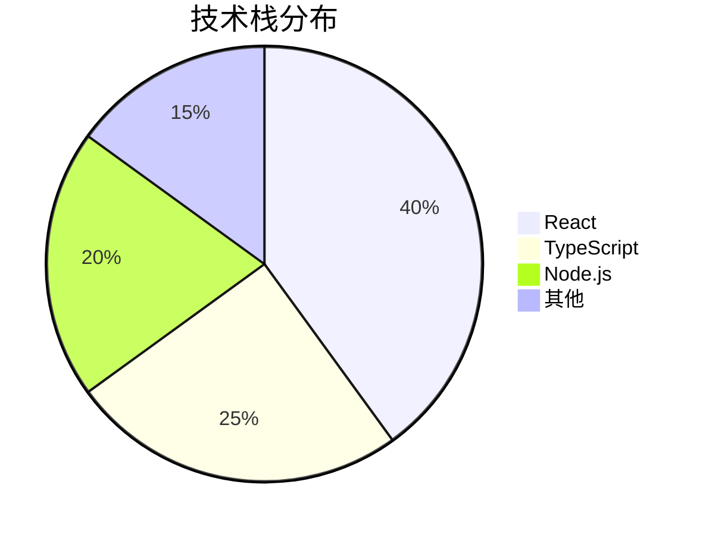
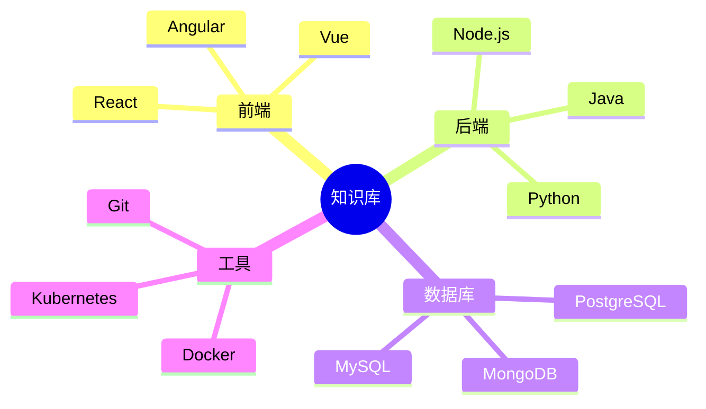

# Mermaid 图表示例

本文档展示了如何在 Docusaurus 中使用 Mermaid 图表。

## 流程图

```mermaid
graph TD
    A[开始] --> B{是否有问题?}
    B -->|是| C[解决问题]
    B -->|否| D[继续前进]
    C --> D
    D --> E[结束]
```

## 时序图

```mermaid
sequenceDiagram
    participant A as 用户
    participant B as 系统
    participant C as 数据库

    A->>B: 发送请求
    B->>C: 查询数据
    C-->>B: 返回结果
    B-->>A: 响应数据
```

## 状态图

```mermaid
stateDiagram-v2
    [*] --> 未开始
    未开始 --> 进行中: 开始任务
    进行中 --> 已完成: 完成任务
    进行中 --> 已取消: 取消任务
    已完成 --> [*]
    已取消 --> [*]
```

## 类图

```mermaid
classDiagram
    class Animal {
        +String name
        +int age
        +eat()
        +sleep()
    }
    class Dog {
        +bark()
        +fetch()
    }
    class Cat {
        +meow()
        +climb()
    }
    Animal <|-- Dog
    Animal <|-- Cat
```

## 甘特图

```mermaid
gantt
    title 项目进度安排
    dateFormat  YYYY-MM-DD
    section 设计阶段
    需求分析       :a1, 2024-01-01, 7d
    系统设计       :a2, after a1, 5d
    section 开发阶段
    前端开发       :b1, after a2, 10d
    后端开发       :b2, after a2, 12d
    section 测试阶段
    单元测试       :c1, after b1, 3d
    集成测试       :c2, after b2, 5d
```

## 饼图

```mermaid
pie title 技术栈分布
    "React" : 40
    "TypeScript" : 25
    "Node.js" : 20
    "其他" : 15
```

## 思维导图

```mermaid
mindmap
  root((知识库))
    前端
      React
      Vue
      Angular
    后端
      Node.js
      Python
      Java
    数据库
      MySQL
      PostgreSQL
      MongoDB
    工具
      Git
      Docker
      Kubernetes
```
